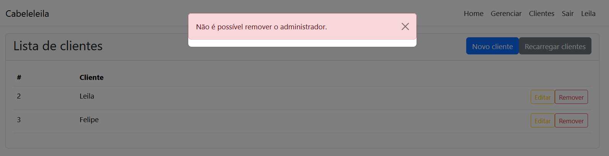

# Leila Cabeleleila Salão de Beleiza

Para a execução do projeto o ambiente deverá possuir as seguintes tecnologias:

Tecnologias utilizadas:

- .NET SDK 6 (6.0.414);
- Node 18.17.1
- npm 9.6.7
- Angular 16.2.2
- MySql 5.7

## Aplicar as Migrations para o banco de dados

Tenha instalado o `dotnet ef`.

```
dotnet tool install --global dotnet-ef --version 6.0.22
```

Estando com o terminal no diretório do back-end, rode:

```
dotnet ef database update --project Cabeleleila.Repository --startup-project Cabeleleila.WebAPI
```

No front-end:

```
npm i
```

## Imagens da solução





# O que utilizei

- Documentação da Microsoft (learn web api);

- Fóruns, tutoriais, StackOverFlow.

- Códigos do meu github.

# A melhorar/implantar

- Tratar erros e outros tipos de retorno na API.
- Validações
- Login com segurança e JWT.
- Retorno de erros da API.
- Layout, UX/UI do front-end.
